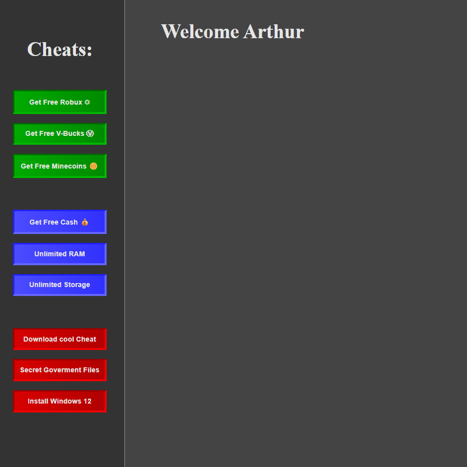
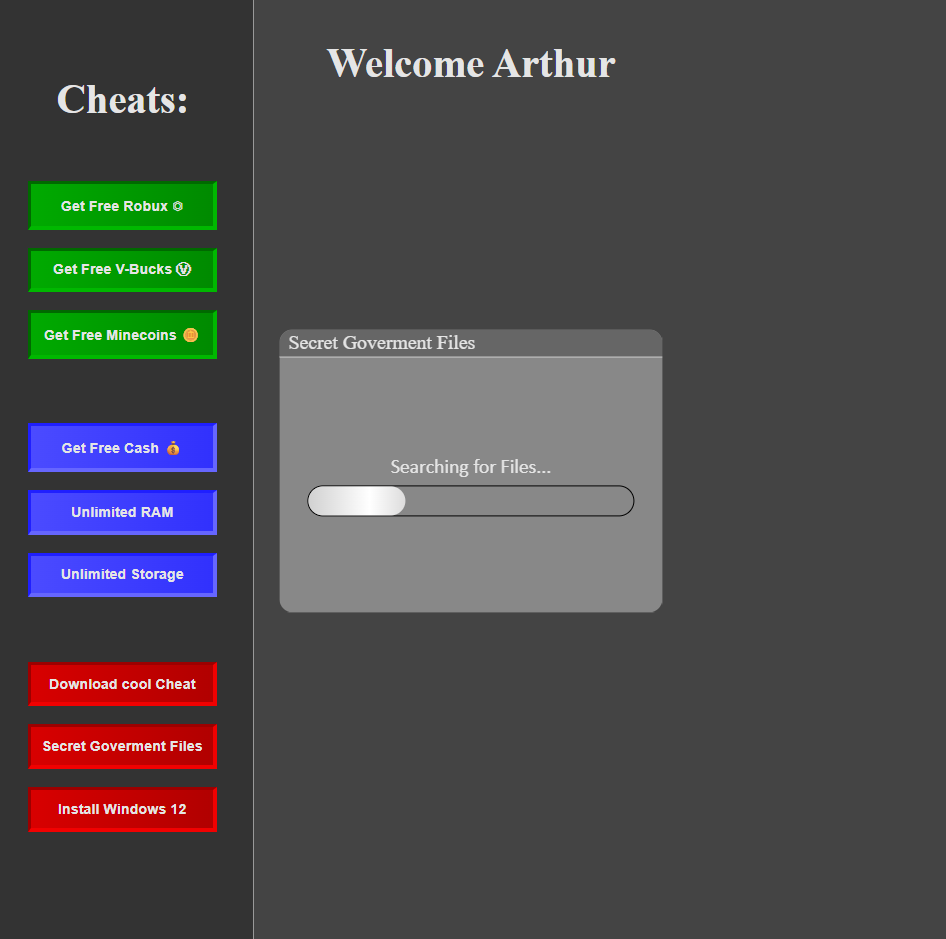
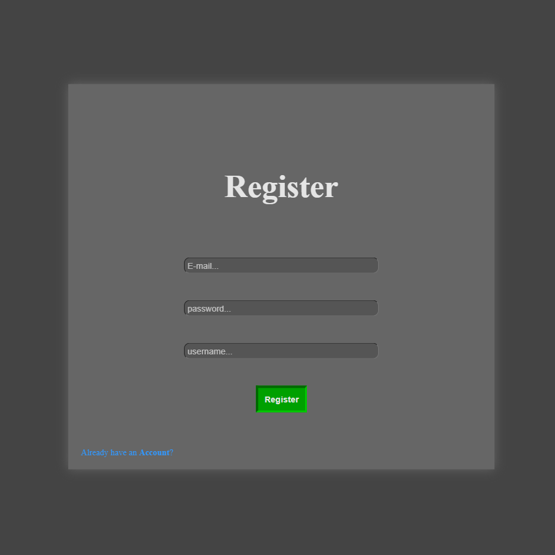

# Registrations-System
Diese Webanwendung erlaubt die **Registrierung** von Benutzern, nach der Registrierung bleibt der Nutzer **automatisch eingeloggt**. Die Anwendung hat eine **Hacker-thematisch** gestaltete Oberfläche und **simuliert** Ladeprozesse, die nur eine visuelle Darstellung sind und **keine Gefahr** darstellen. Das Projekt wird aktiv **weiterentwickelt** und **erweitert**.

## Funktionen
- Registrierung von Nutzern
- Automatisches Einloggen nach der Registrierung
- Speicherung in einer MySQL-Datenbank
- Simulierte Ladeprozesse und interaktive Eingabefenster
- Automatisches Ausloggen nach einem Jahr über Cookie-Laufzeit

## Technologien & Tools
1. HTML5
2. CSS3
3. JavaScript
4. PHP
5. MySQL

## Screenshots
### Startseite

### Simulierter Ladeprozess

### Registrierung

## Was habe ich gelernt?
- Arbeit mit MySQL-Datenbanken
- Entwicklung serverseitiger Logik mit PHP
- Gestaltung von Webanwendungen im Dark-Mode
- Umgang mit asynchronen Funktionen und Promises
- Strukturierte Arbeit mit Objekten
- Kontrollierte Ablaufsteuerung von Programmen
